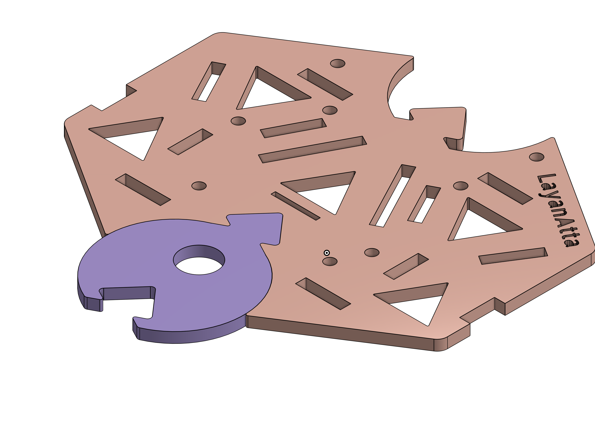
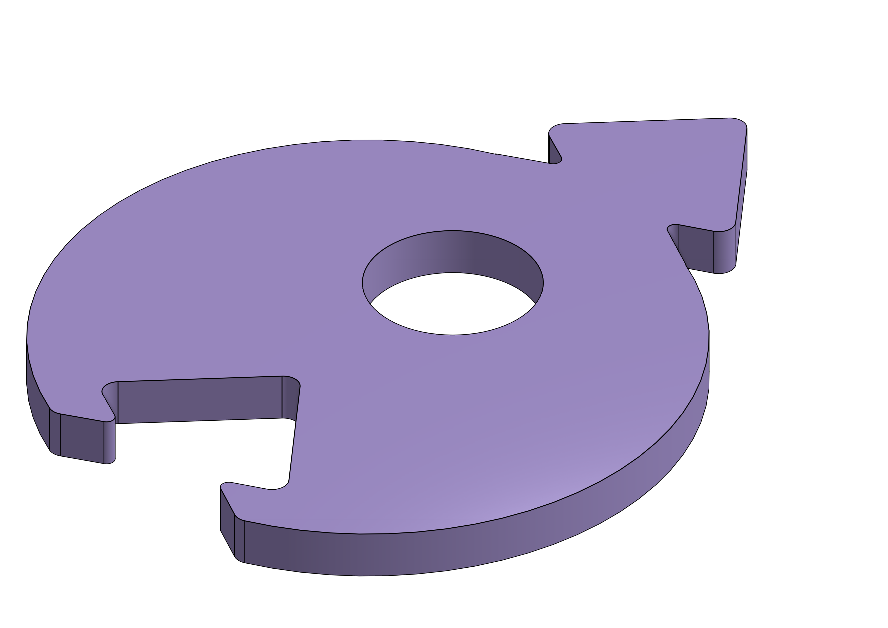
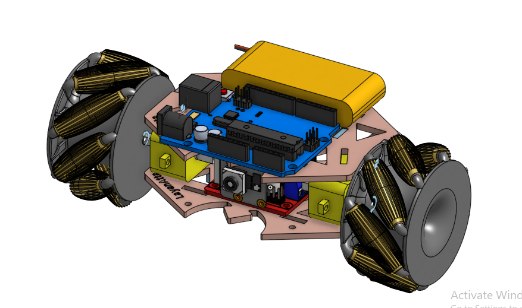

2-wheel-robot
# تصميم شاسيه روبوت معياري وخفيف الوزن

هذا المشروع يوثق عملية تصميم وتطوير شاسيه (قاعدة) لروبوت بعجلتين، مع التركيز على الكفاءة، خفة الوزن، وإمكانية الترقية المستقبلية.

---

### 🎯 الهدف من المشروع (Project Goal)

الهدف الأساسي كان تصميم شاسيه يتميز بالكفاءة العالية، الفائدة، والميزات المتعددة، مع الحفاظ على وزن خفيف جدًا لا يتجاوز 13 جرامًا، ليكون قاعدة مثالية لمختلف تطبيقات الروبوتات.

---

### ✨ الفكرة المبتكرة: التصميم القابل للتوسيع (The Innovative Idea: Modular Design)

الحل الأبرز في هذا التصميم هو **قابلية الترقية والتوسيع**. بدلاً من تصميم شاسيه لروبوت ثنائي فقط، تم تصميم **قطعة ربط (Connector)** تسمح بربط وحدتين من الشاسيه معًا بسهولة.

هذا التصميم المعياري يسمح بتحويل الروبوت من **ثنائي الدفع (2WD)** إلى **رباعي (4WD)**، **سداسي (6WD)**، أو حتى **ثماني (8WD)**، مع الحفاظ على نفس الكفاءة الهيكلية والتوازن.

  
  

---

### 🛠️ الميزات الرئيسية للتصميم (Key Design Features)

تم التركيز على تصميم شكل مميز وكفؤ من خلال دمج عدة ميزات:
* **هيكل مفرّغ:** تم إضافة أشكال مفرغة (مثلثات ودوائر) لتقليل الوزن بشكل كبير مع الحفاظ على الصلابة الهيكلية.
* **حواف منحنية (Filleted Edges):** تم تحويل الزوايا والحواف الحادة إلى منحنيات ناعمة لتقليل نقاط تركيز الإجهاد (Stress Concentration) وزيادة متانة الشاسيه ومقاومته للكسر.
* **فتحات متعددة الأغراض:** تم تصميم فتحات مخصصة لتثبيت المسامير، ولعملية الربط، وللمساعدة في موازنة توزيع الوزن والحرارة الناتجة عن المحركات.
* **شكل فريد:** تم تصميم الشاسيه بشكل انسيابي وجذاب يخدم الغرض الوظيفي والجمالي في آن واحد.

.png)

---

### 🔬 الاختبار والمحاكاة (Testing & Simulation)

تم بناء الروبوت بشكل كامل في بيئة التجميع (Assembly) داخل Onshape للتحقق من توافق جميع المكونات. شمل التجميع:
* عجلات ميكانوم (Mecanum Wheels)
* محركات TT ومثبتاتها
* لوحة الأردوينو (Arduino Uno)
* درع المحرك (H-Bridge L298N)
* كاميرا كـ "عين" للروبوت
* بطارية 9V

---

### 📊 المواصفات الفنية (Technical Specifications)

* **الوزن:** ~12 جرامًا (أقل من الحد المطلوب 13 جرامًا).
* **الأبعاد:**
    * الطول: ~90 مم
    * العرض: ~110 مم
    * الارتفاع: 3.5 مم

---

### ⚙️ إعدادات الطباعة المقترحة (Slicer Settings)

* **المادة المقترحة:** **PETG**
    * تم اختيار PETG لصلابته ومتانته العالية وقدرته على تحمل الصدمات بشكل أفضل من PLA، وهو أمر ضروري لحماية المكونات الإلكترونية المثبتة على الشاسيه.
* **نمط التعبئة (Infill Pattern):** Honeycomb (خلية النحل)
* **نسبة التعبئة (Infill Density):** 30%

[صورة لإعدادات ووزن الشاسيه من AnkerMake Studio هنا]

---

### 🧠 الدروس المستفادة (What I Learned)

* **أهمية تخفيف الوزن:** تعلمت كيف يمكن للتفريغات الهيكلية أن تقلل الوزن بشكل كبير دون التضحية بالقوة.
* **توافق المكونات الميكانيكية:** اكتشفت أن ليس كل العجلات تتوافق مع كل المحركات مباشرة، فبعضها يحتاج إلى قطعة وسيطة (Hub).
* **الفرق بين أنواع العجلات:** تعلمت الفرق العملي بين العجلات العادية، الأومني، والميكانوم، وأن عجلات الميكانوم تعمل بكفاءتها الكاملة في نظام رباعي.

---

### 🔗 رابط التصميم (Onshape Link)

يمكنك الاطلاع على التصميم الكامل والتفاعل معه مباشرة من خلال الرابط التالي:

